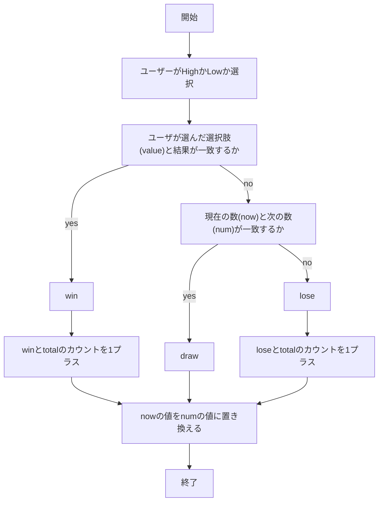
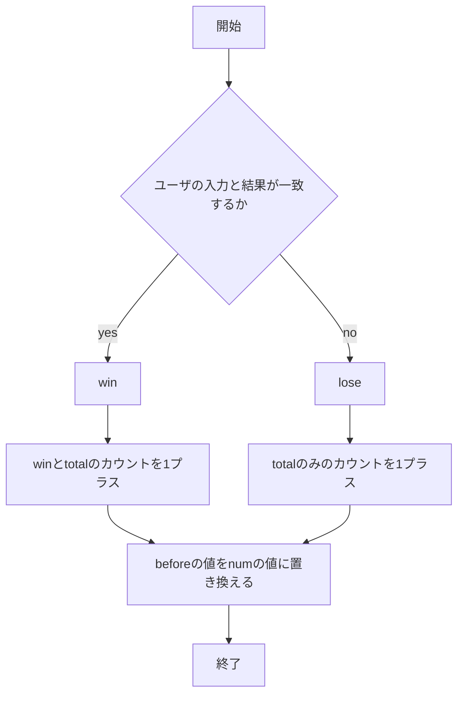

# webpro_06
2024.11.18

## High&Lowのプログラムについて

```javasript
「High & Low」
-概要-
playerは現在の数よりも次にランダムで生成される数が大きい(High)か小さい(Low)かを当てる
ゲームである．

-処理-
1.1~10の数字がランダムで生成されて現在の数(now)として表示される．
2.次にランダムで出力される数(num)がnowよりも大きいか小さいかを予想し，ラジオボタンで
  HighかLowかを選ぶ．
3.その結果が選択肢と一致するならresultをwinとし，winとtotalのカウントを1プラスする．
  一致しなかった場合はnumとnowが一致するかを調べる．
  numとnowが一致するならresultをdrawにし，totalカウントのみを1プラスする．
  前述の条件に一致しなかった場合resultをloseとし，loseとtotalのカウントを1プラスする．
4.その後出力されたnumを次の数とするためnowをnumの数値に置き換え，次回に引き継ぐ．
5.2~4を繰り返す．

-起動方法-
1.ターミナルなどでapp5.jsやviews,publicが保存されたディレクトリに合わせる．
2.node app5.jsでローカルサーバーを起動する
3.Example app listening on port 8080!と返される．
4.http://localhost:8080/highlow でページにアクセスする．
```


## 隠蔽看破のプログラムについて

```javasript
「隠蔽看破」
-概要-
このゲームはアクマゲームという作品に登場する 「隠蔽看破~Hide & See~」というゲームを
もとにしてPlayerはコインが隠された机の位置を5つの机から当てる看破役を擬似的に体験できる．

-処理-
1.numを1~5からランダムで生成される．
2.Playerは1~5の机のナンバー(value)を選ぶ．
3.numとvalueが一致するか確認する．
4.一致したらresultをwinとしwinとtotalのカウントを1進める．
　一致しなかった場合はtotalカウントのみを1進める．
5.numをbeforeに代入し，前回の机のナンバーとして表記する．

-起動方法-
1.ターミナルなどでapp5.jsやviews,publicが保存されたディレクトリに合わせる．
2.node app5.jsでローカルサーバーを起動する
3.Example app listening on port 8080!と返される．
4.http://localhost:8080/inpeikanpa でページにアクセスする．
```


