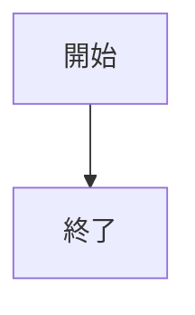
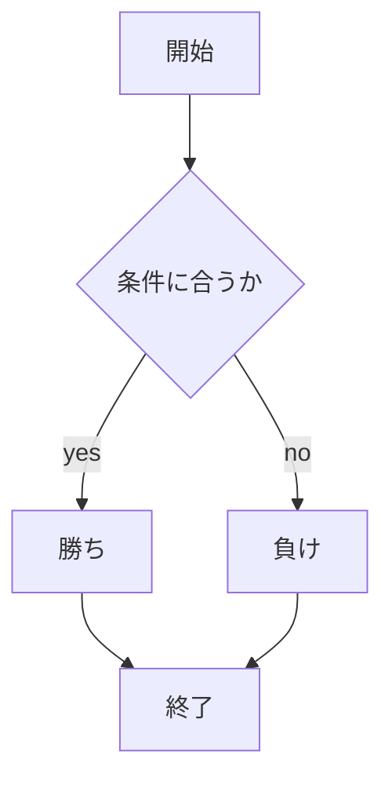

# webpro_06
2024.10.29

## このプログラムについて

## ファイル一覧

ファイル名 | 説明
-|-
app5.js | プログラム本体
public/janken.html | じゃんけんの開始画面

```javasript
console.log('Hello');
```





```javasript
「High & Low」
1~10の数字がランダムで生成されて現在の数(now)として表示される．

```