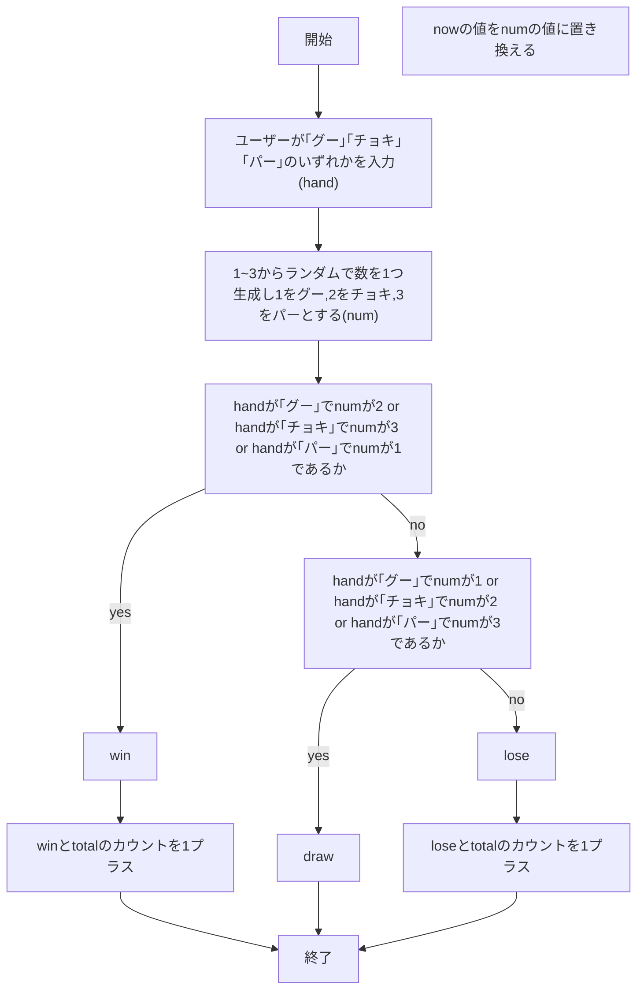
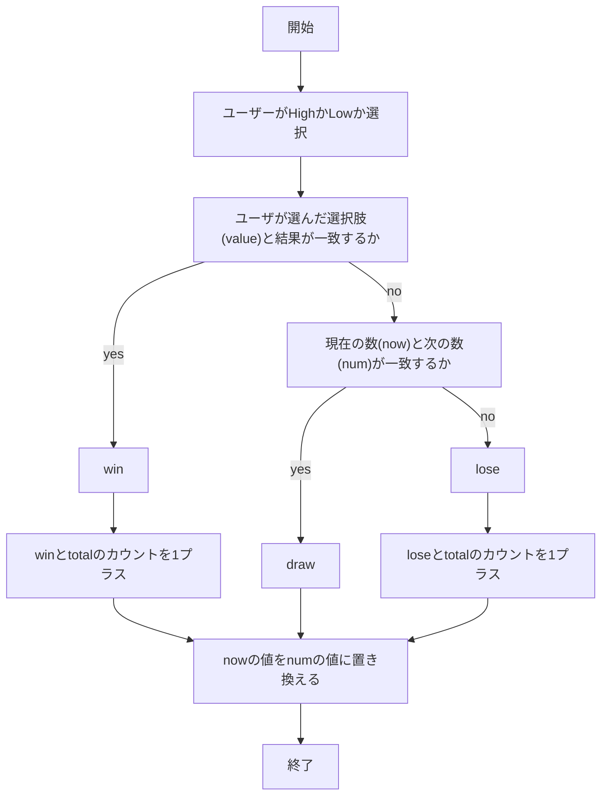
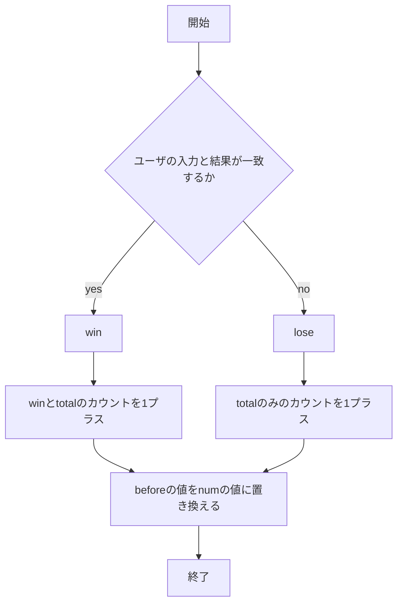

# webpro_06
2024.11.18

## 概要

ファイル名 | 機能の簡易説明
-|-
app5.js | プログラム本体
janken.ejs | ユーザーの出す手の入力画面やじゃんけんの勝敗や勝敗カウントなどを表示する
highlow.ejs |　HighとLowのボタンやその時の結果，勝敗カウントを表示する
inpeikanpa.ejs |　１〜５のボタンやその時の結果，勝敗カウントを表示する

### じゃんけんのプログラムについて
```javasript
「じゃんけん」
-説明-
playerは「グー」「チョキ」「パー」のいずれかをを入力することでじゃんけんをすることができる

-使用するファイル-
・app5.js
・janken.ejs

-起動方法-
1.ターミナルなどでapp5.jsやviews,publicが保存されたディレクトリに合わせる．
2.node app5.jsでローカルサーバーを起動する
3.Example app listening on port 8080!と返される．
4.http://localhost:8080/janken でページにアクセスする．

-処理-
1.playerは「グー」「チョキ」「パー」から１つを選択し入力する．この入力をhandとする．
2.次にランダムで出力される数(num)を1=グー，2=チョキ，3=パーと見立ててる．
3.handとnumの関係性をif文にそって処理する．
  勝敗が勝ちとなった場合，「勝ち」と表示し，winカウントとtotalカウントをそれぞれ1足す．
  勝敗があいことなった場合，「あいこ」と表示する．
  勝敗が負けとなった場合，「なんで負けたか明日まで考えといてください」と表示し，totalカウントのみを1足す．
4.1~3を繰り返す．
```

### High&Lowのプログラムについて

```javasript
「High & Low」
-説明-
playerは現在の数よりも次にランダムで生成される数が大きい(High)か小さい(Low)かを当てる
ゲームである．

-使用するファイル-
・app5.js
・highlow.ejs

-起動方法-
1.ターミナルなどでapp5.jsやviews,publicが保存されたディレクトリに合わせる．
2.node app5.jsでローカルサーバーを起動する
3.Example app listening on port 8080!と返される．
4.http://localhost:8080/highlow でページにアクセスする．

-処理-
1.1~10の数字がランダムで生成されて現在の数(now)として表示される．
2.次にランダムで出力される数(num)がnowよりも大きいか小さいかを予想し，ラジオボタンで
  HighかLowかを選ぶ．
3.その結果が選択肢と一致するならresultをwinとし，winとtotalのカウントを1プラスする．
  一致しなかった場合はnumとnowが一致するかを調べる．
  numとnowが一致するならresultをdrawにし，totalカウントのみを1プラスする．
  前述の条件に一致しなかった場合resultをloseとし，loseとtotalのカウントを1プラスする．
4.その後出力されたnumを次の数とするためnowをnumの数値に置き換え，次回に引き継ぐ．
5.2~4を繰り返す．
```


### 隠蔽看破のプログラムについて

```javasript
「隠蔽看破」
-説明-
このゲームはアクマゲームという作品に登場する 「隠蔽看破~Hide & See~」というゲームを
もとにしてPlayerはコインが隠された机の位置を5つの机から当てる看破役を擬似的に体験できる．

-使用するファイル-
・app5.js
・inpeikanpa.ejs

-起動方法-
1.ターミナルなどでapp5.jsやviews,publicが保存されたディレクトリに合わせる．
2.node app5.jsでローカルサーバーを起動する
3.Example app listening on port 8080!と返される．
4.http://localhost:8080/inpeikanpa でページにアクセスする．

-処理-
1.numを1~5からランダムで生成される．
2.Playerは1~5の机のナンバー(value)を選ぶ．
3.numとvalueが一致するか確認する．
4.一致したらresultをwinとしwinとtotalのカウントを1進める．
　一致しなかった場合はtotalカウントのみを1進める．
5.numをbeforeに代入し，前回の机のナンバーとして表記する．
```

