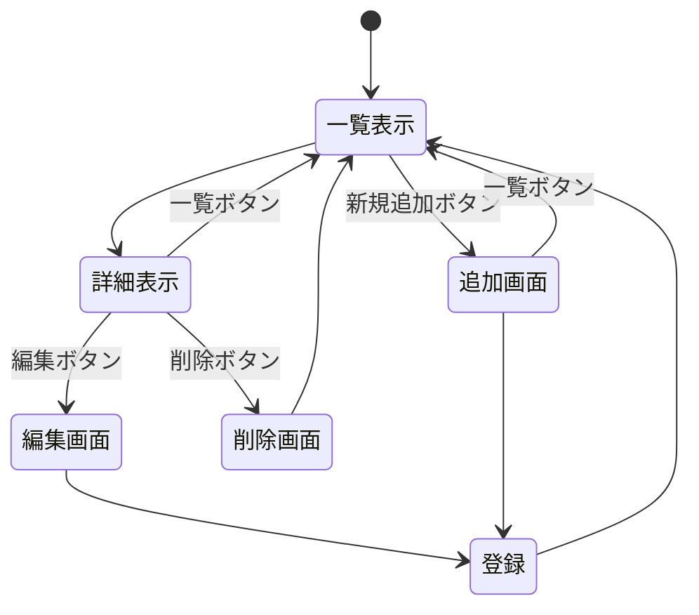
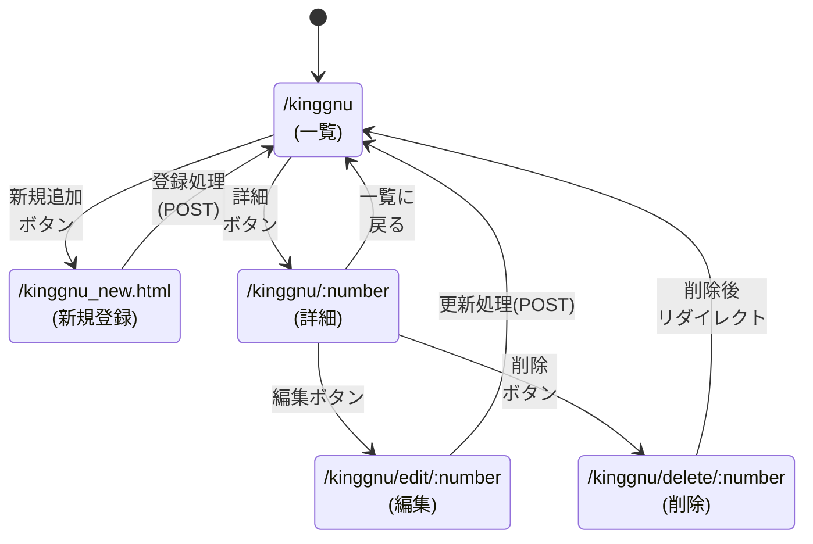
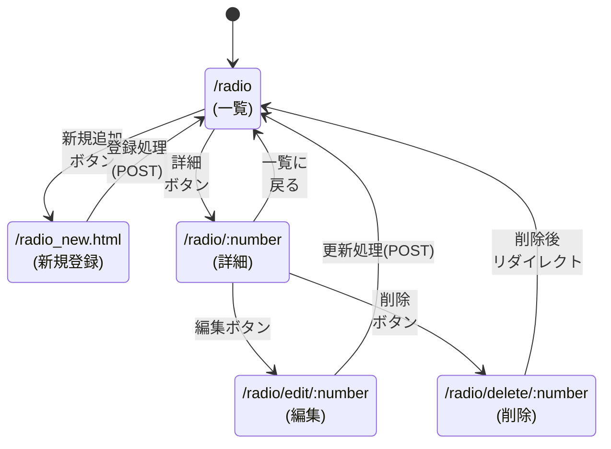
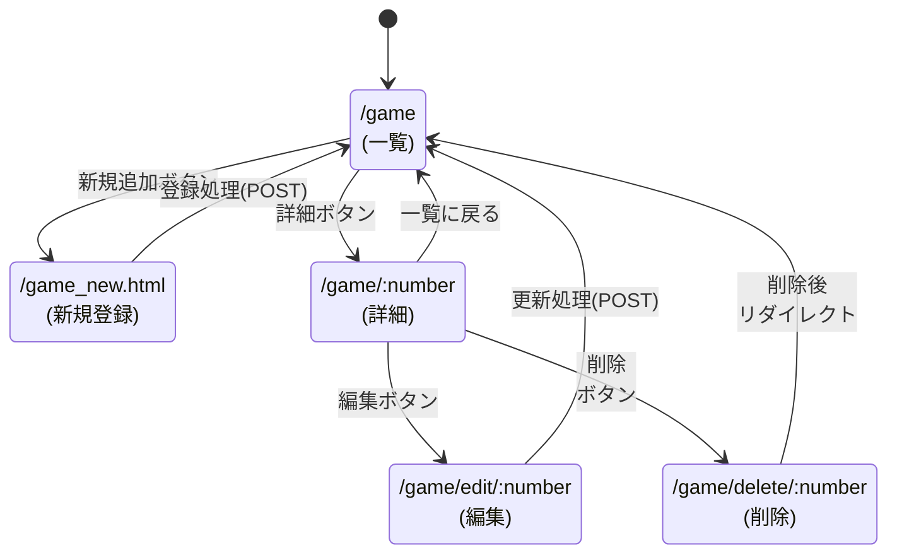

# 仕様書

## 利用者向け

## 管理者向け

## 開発者向け

```mermaid
stateDiagram-v2
    [*] --> 一覧表示
    一覧表示 --> 詳細表示
    詳細表示 --> 編集画面: 編集ボタン
    編集画面 --> 登録
    登録 --> 一覧表示
    一覧表示 --> 追加画面: 新規追加ボタン
    追加画面 --> 登録
    詳細表示 --> 削除画面: 削除ボタン
    削除画面 --> 一覧表示
    詳細表示 --> 一覧表示: 一覧ボタン
    追加画面 --> 一覧表示: 一覧ボタン
```

```mermaid
stateDiagram-v2
    direction TB

    state "/kinggnu<br/>(一覧)" as List
    state "/kinggnu_new.html<br/>(新規登録)" as NewForm
    state "/kinggnu/:number<br/>(詳細)" as Detail
    state "/kinggnu/edit/:number<br/>(編集)" as Edit
    state "/kinggnu/delete/:number<br/>(削除)" as Delete

    [*] --> List

    List --> NewForm : 新規追加<br/>ボタン
    NewForm --> List : 登録処理<br/>(POST)

    List --> Detail : 詳細<br/>ボタン
    Detail --> List : 一覧に<br/>戻る

    Detail --> Edit : 編集ボタン
    Edit --> List : 更新処理(POST)

    Detail --> Delete : 削除<br/>ボタン
    Delete --> List : 削除後<br/>リダイレクト
```

```mermaid
stateDiagram-v2
    direction TB

    state "/radio<br/>(一覧)" as R_List
    state "/radio_new.html<br/>(新規登録)" as R_NewForm
    state "/radio/:number<br/>(詳細)" as R_Detail
    state "/radio/edit/:number<br/>(編集)" as R_Edit
    state "/radio/delete/:number<br/>(削除)" as R_Delete

    [*] --> R_List

    R_List --> R_NewForm : 新規追加<br/>ボタン
    R_NewForm --> R_List : 登録処理<br/>(POST)

    R_List --> R_Detail : 詳細<br/>ボタン
    R_Detail --> R_List : 一覧に<br/>戻る

    R_Detail --> R_Edit : 編集ボタン
    R_Edit --> R_List : 更新処理(POST)

    R_Detail --> R_Delete : 削除<br/>ボタン
    R_Delete --> R_List : 削除後<br/>リダイレクト
```

```mermaid
stateDiagram-v2
    direction TB

    state "/game<br/>(一覧)" as G_List
    state "/game_new.html<br/>(新規登録)" as G_NewForm
    state "/game/:number<br/>(詳細)" as G_Detail
    state "/game/edit/:number<br/>(編集)" as G_Edit
    state "/game/delete/:number<br/>(削除)" as G_Delete

    [*] --> G_List

    G_List --> G_NewForm : 新規追加ボタン
    G_NewForm --> G_List : 登録処理(POST)

    G_List --> G_Detail : 詳細ボタン
    G_Detail --> G_List : 一覧に戻る

    G_Detail --> G_Edit : 編集ボタン
    G_Edit --> G_List : 更新処理(POST)

    G_Detail --> G_Delete : 削除<br/>ボタン
    G_Delete --> G_List : 削除後<br/>リダイレクト
```
