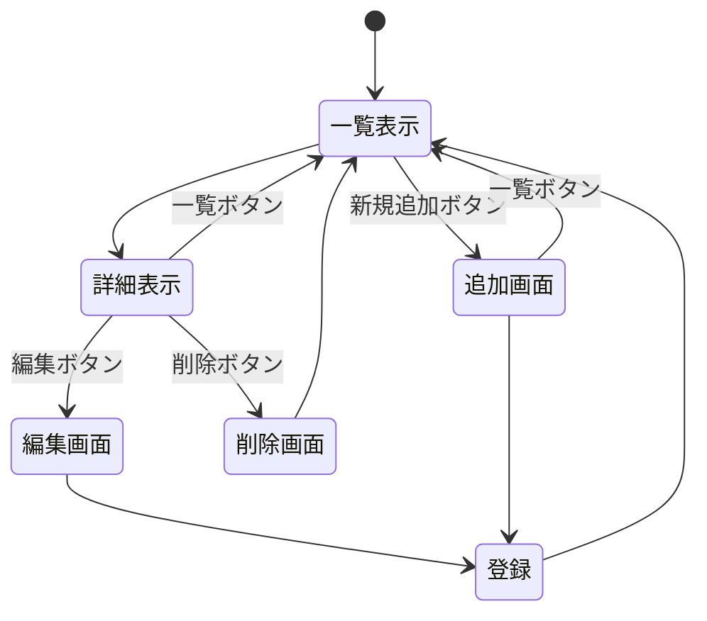
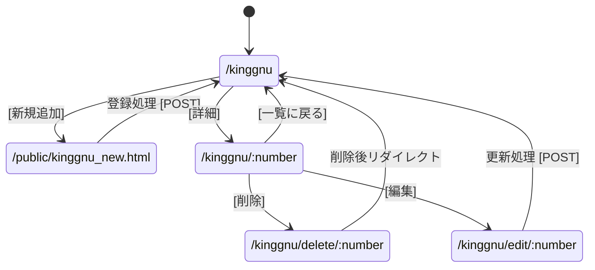
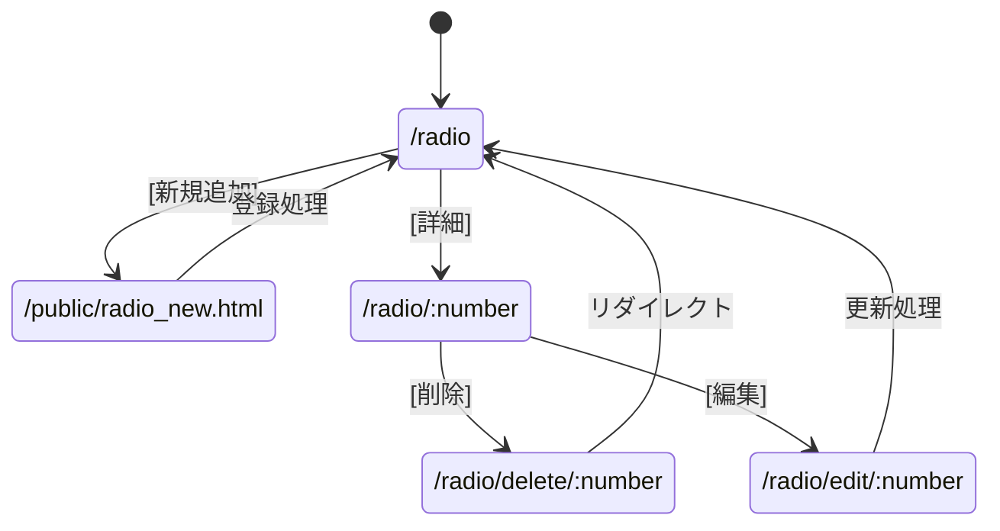

# 仕様書
## 利用者向け
## 管理者向け
## 開発者向け





```mermaid
stateDiagram-v2
    state "/game" as G_List
    state "/public/game_new.html" as G_NewForm
    state "/game/:number" as G_Detail
    state "/game/edit/:number" as G_Edit
    state "/game/delete/:number" as G_Delete

    [*] --> G_List
    G_List --> G_NewForm: [新規追加]
    G_NewForm --> G_List: 登録処理
    G_List --> G_Detail: [詳細]
    G_Detail --> G_Delete: [削除]
    G_Delete --> G_List: リダイレクト
    G_Detail --> G_Edit: [編集]
    G_Edit --> G_List: 更新処理
 ```