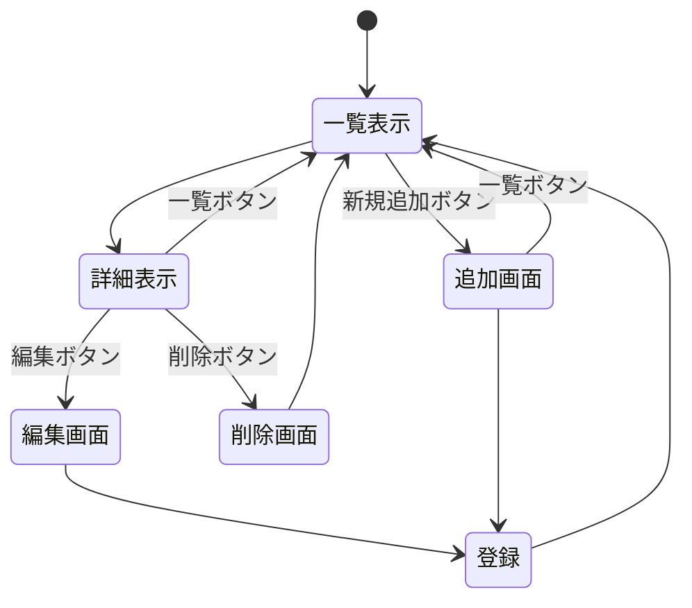
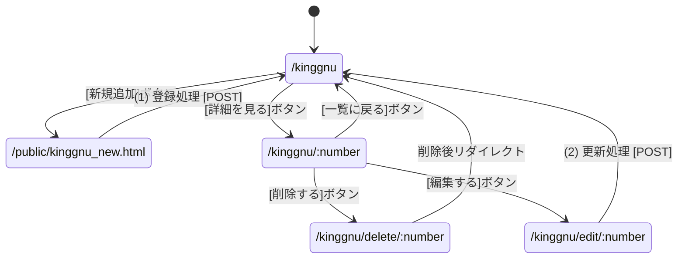

# 仕様書
## 利用者向け
## 管理者向け
## 開発者向け

```mermaid
stateDiagram-v2
    [*] --> 一覧表示
    一覧表示 --> 詳細表示: 
    詳細表示 --> 編集画面: 編集ボタン
    編集画面 --> 登録
    登録 --> 一覧表示
    一覧表示 --> 追加画面: 新規追加ボタン
    追加画面 --> 登録
    詳細表示 --> 削除画面: 削除ボタン
    削除画面 --> 一覧表示
    詳細表示 --> 一覧表示: 一覧ボタン
    追加画面 --> 一覧表示: 一覧ボタン
```

```mermaid
stateDiagram-v2
    state "/kinggnu" as List
    state "/public/kinggnu_new.html" as NewForm
    state "/kinggnu/:number" as Detail
    state "/kinggnu/edit/:number" as Edit
    state "/kinggnu/delete/:number" as Delete

    [*] --> List
    List --> NewForm: [新規追加]ボタン
    NewForm --> List: (1) 登録処理 [POST]

    List --> Detail: [詳細を見る]ボタン
    Detail --> List: [一覧に戻る]ボタン
    
    Detail --> Delete: [削除する]ボタン
    Delete --> List: 削除後リダイレクト

    Detail --> Edit: [編集する]ボタン
    Edit --> List: (2) 更新処理 [POST]
```